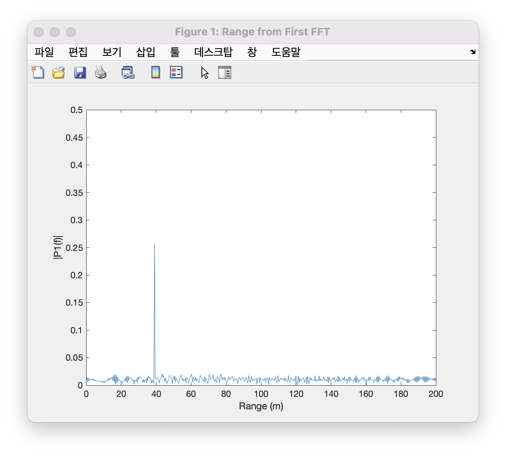
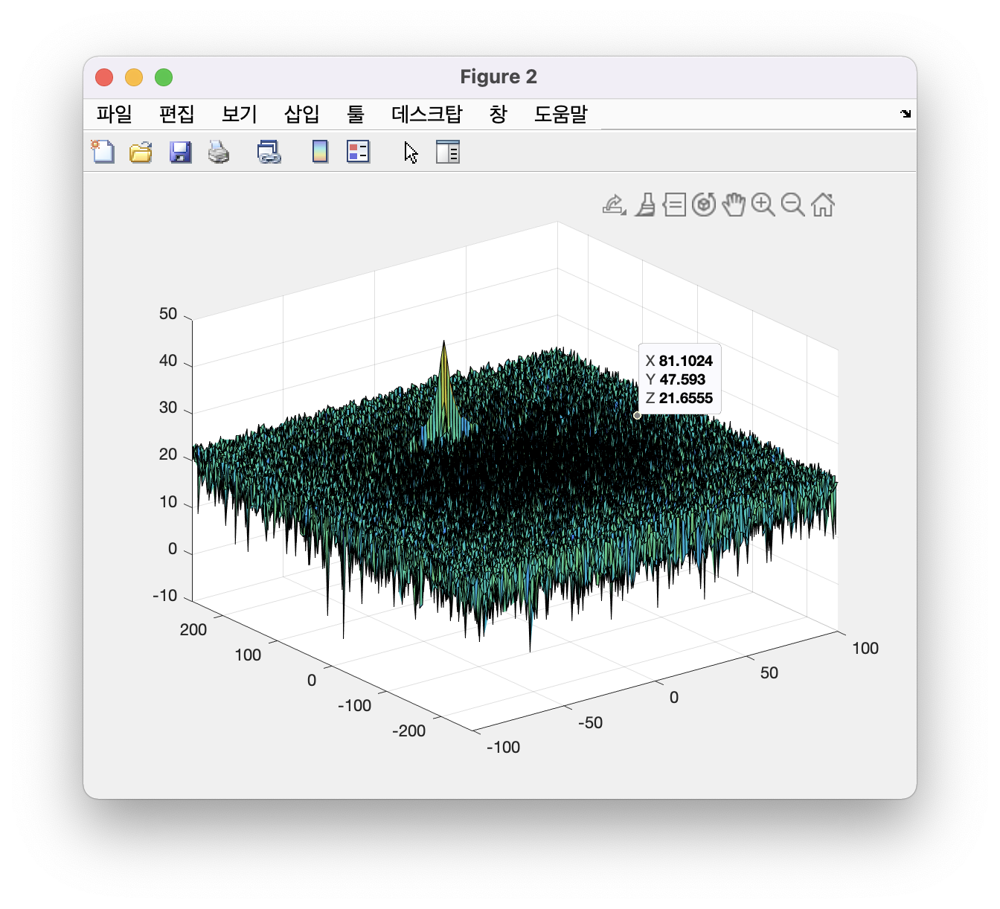
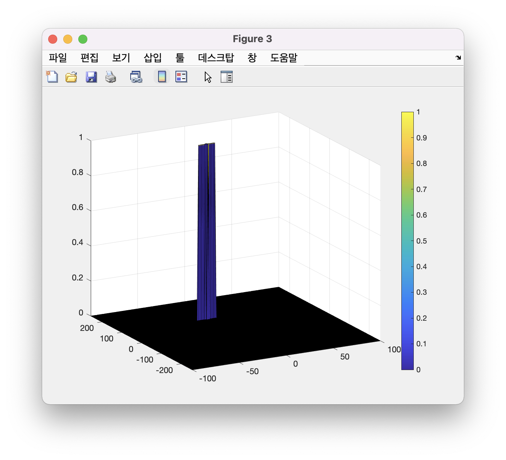

# SFND_Radar

Final Project of Radar with Matlab for SFND

## Dependency

-   Matlab 2021b

## Result

### Set up the Initial Position and Velocity

```matlab
R = 100;
v = -10;
```

### Design the FMCW waveform

```matlab
c = 3e8; % m/s
R_max = 200; % m
R_res = 1; % m
v_max = 100; % m/s
B = c / (2 * R_res); % Hz
Tchirp = 5.5 * 2 * R_max / c; % s
slope = B / Tchirp; % s^-2
```

### FFT



### FFT 2D



### 2D CFAR


